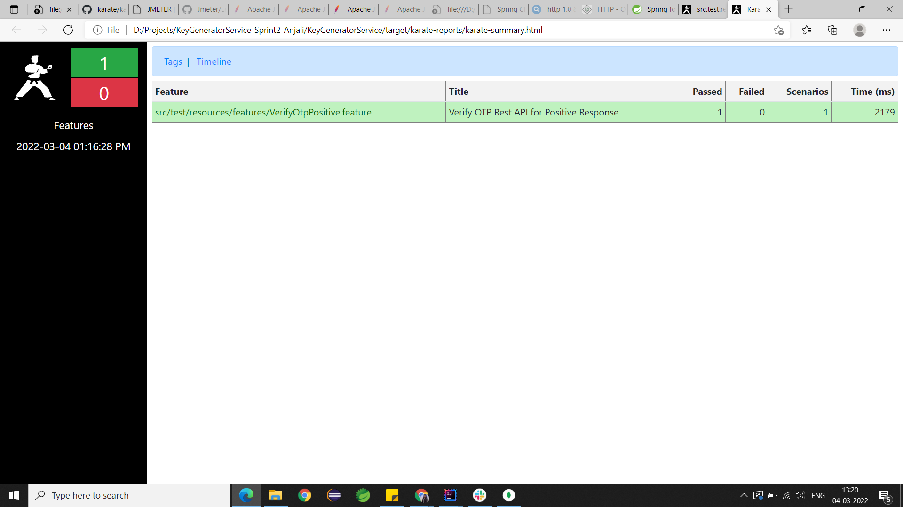
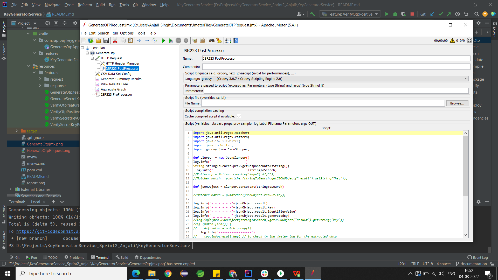
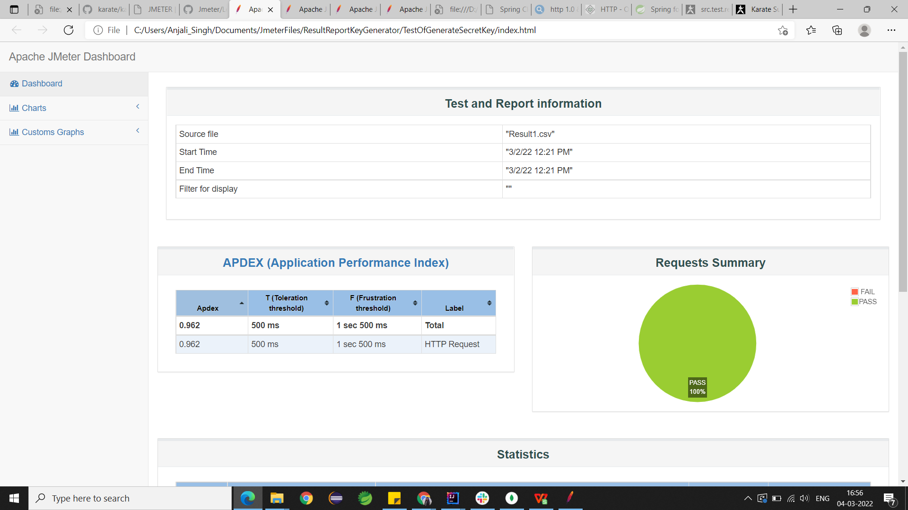

content...

#Key Generator Service

The **Key Generator Service** will be used to generate the key based on the other service requirement. The service will decide whether it want OTP or Secret Key as a Key.

It has 4 APIs -

* generate_otp

* verify_otp

* generate_secret_key

* verify_secret_key

KeyGenerator Service will generate the keys everytime there is a request to generate the Key and everytime the record will be maintained for the user. 

We are going to keep every data and will be archiving not deleting.

If there is a request for the regeneration of key in case the key was not received. The regeneration will be done after 30 seconds of last generated key.

The records in the DB will be uniquely identified by identifierValue (either email or phone number) and generatedBy (service hitting the request).
With one identifierValue and generated by there can be many records but for the verification of the key the last generated key will be fetched from the DB.

The number of attempts for the verification of the key will be maintained and if user enters incorrect key ,will be keeping a count on it.

The response and other details about the API is here - https://rapipayhq.atlassian.net/wiki/spaces/NYE/pages/1844019222/Key+Generator+APIs

##KARATE Test 

Karate is built on top of Cucumber, another BDD(Behavior Driven Development) testing framework, and shares some of the same concepts. One of these is the use of a Gherkin file, which describes the tested feature. However, unlike Cucumber, tests aren't written in Java and are fully described in the Gherkin file.

A Gherkin file is saved with the “.feature” extension. It begins with the Feature keyword, followed by the feature name on the same line. It also contains different test scenarios, each beginning with the keyword Scenario and consisting of multiple steps with the keywords Given, When, Then, And, and But.

Dependency for Karate

~~~
<dependency>
    <groupId>com.intuit.karate</groupId>
    <artifactId>karate-junit4</artifactId>
    <version>1.1.0</version>
    <scope>test</scope>
</dependency>
~~~

* In order to write karate test cases and run it, you must have a Gherkin Plugin and Cucumber Plugin installed in your IDE.
* The karate test cases are written in Gherkin .feature file.

#### Scenario of Post Request 
~~~
Scenario: Generate OTP with the given
  Given  path '/generate_otp'
  And request generateOtpRequest
  When method POST
  Then status 200
  And print response
  And match response.status == "OK"
  And match response == expectedOutput
~~~

###### The match operation is used for the validation 

For verification of OTP generation request is called and then the response of the generation request is sent as request for verification of the OTP.
~~~
 Scenario: Send OTP to mobile number
    Given path '/generate_otp'
    And request generateOtpRequest
    When method POST
    Then status 200
    And print response
    Then path "/verify_otp"
    Given request { identifierValue:#(response.result.identifierValue) , key :#(response.result.key) , generatedBy :#(response.result.generatedBy) }
    When method POST
    Then status 200
    And print response
    Then response.message = "OTP verified successfully"
~~~

Now that the test scenarios are complete, we can run our tests by integrating Karate with JUnit.

We'll use the @CucumberOptions annotation to specify the exact location of the Feature files:

~~~
@RunWith(Karate.class)
@CucumberOptions(features = "classpath:src/test/resources/features")
public class KeyGeneratorFeature {
}
~~~

Karate generates report for testcases.

## JMeter Performance Testing

JMeter is a test tool from Apache used to analyze and measure the performance of applications, different software services and products. It is open source software entirely written in Java, used to test both web and FTP applications as long as the system supports a Java Virtual Machine (JVM).

Benefits of JMeter
* Open source license
* Friendly GUI
* Platform independent
* Full multithreading framework
* Visualize Test Result
* Simulation
* Script Test
* Multiple testing strategy (Load Testing, Distributed Testing, Functional Testing)

>The JMeter testing for this Service has been done locally for now, will be testing it to AWS instance soon and updating the changes.

#### For the Request of GenerateOTP

For now 500 requests has been added.

GenerateOTP.jmx File snapshot

The response of the GenerateOtp request is stored in a csv file, so that that response can act as request for VerifyOtp request.

The request body is passed in the HTTP request in jmeter as --
~~~
{
    "identifierName": "${identifierName}",
    "identifierValue": "${identifierValue}",
    "generatedBy": "${generatedBy}"
}
~~~

The above values are been fetched from csv file we added in the CSV File Config.

For running the jmeter through command prompt and generate the report of the jmeter request  you should write the following command.

~~~
jmeter -n -t <LOCATION_TO_FETCH_JMX_FILE> -l <LOCATION_TO_STORE_RESULTANT_CSV> -e -o <LOCATION_OF_FOLDER_TO_PRODUCE_RESULTANT_REPORT>

~~~

Result of the report 

